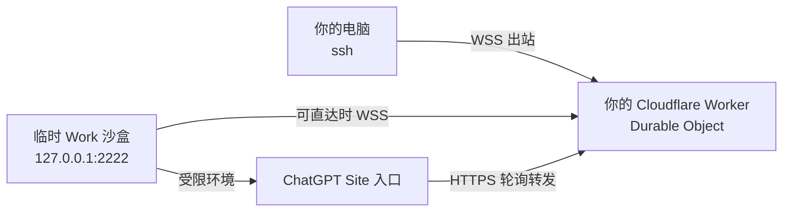

# WorkSSH Relay

通过你自己的 Cloudflare Worker，把本地 SSH 客户端连接到一个只允许主动出站
WebSocket 的临时 Work 沙盒。

> 非官方社区项目，与 OpenAI、ChatGPT 或 Cloudflare 均无隶属关系。只可用于你
> 拥有或明确获准管理的环境。

## 它解决什么问题

很多托管沙盒没有公网入站端口，但可以发起 HTTPS/WebSocket 出站连接。WorkSSH
让沙盒端和本地端都主动连接到你自己的 Worker；Worker 只转发已经由 SSH 加密的
字节流。部分 ChatGPT Work 环境还会阻止直接访问 `workers.dev`，这种情况下需要
增加一个工作区 Site 入口。



## 安全默认值

- SSH 服务仅监听沙盒的 `127.0.0.1`，不开放公网端口。
- 只接受一把显式配置的 SSH 公钥；密码登录关闭。
- Worker 需要独立的高熵 `RELAY_TOKEN`。
- 配置文件权限为 `0600`，所有真实配置都被 `.gitignore` 排除。
- Relay 使用 Base64 文本帧承载 SSH 字节，避免不同 Worker 运行时的 Blob/二进制
  兼容问题；SSH 加密仍然是端到端的。
- 不支持 SSH 端口转发，默认只提供 shell 和远程命令。

## 5 分钟快速开始

要求：Cloudflare 账号、Node.js 22+、`git`、`ssh`、`ssh-keygen`。

### 1. 部署自己的 relay

```bash
git clone https://github.com/catoncat/workssh-relay.git
cd workssh-relay/relay
npm install
npx wrangler login
openssl rand -hex 32
npx wrangler secret put RELAY_TOKEN
npm run deploy
```

保存最后一条命令输出的 Worker URL，以及你刚生成的 token。检查：

```bash
curl https://YOUR_WORKER_URL/health
```

如果 Work 沙盒访问这个 URL 超时，但你的本地电脑可以访问，请先部署
[Site 入口](docs/SITE_INGRESS.md)。本地电脑仍直连 Worker，只有沙盒 Agent 使用
Site URL。部署前也必须从沙盒测试 Site `/health`；如果执行层同时禁止
`workers.dev` 和 `chatgpt.site`，任何仓库内的 Relay 代码都无法绕过该出口白名单，
需要平台放行其中一个域名或换到允许访问的环境。

### 2. 让 Work Agent 安装沙盒端

在 Work 对话里附上你的 SSH **公钥**，再把 [AGENT_TASK.md](AGENT_TASK.md) 的
提示词交给 Agent。不要在聊天里发送 SSH 私钥或 Cloudflare API Token。

也可以在沙盒终端直接运行：

```bash
git clone https://github.com/catoncat/workssh-relay.git
cd workssh-relay
export WORKSSH_WORKER_URL="https://YOUR_WORKER_URL"
export WORKSSH_RELAY_TOKEN="YOUR_RELAY_TOKEN"
export WORKSSH_TUNNEL_ID="$(openssl rand -hex 16)"
export WORKSSH_PUBLIC_KEY_FILE="/path/to/id_ed25519.pub"
# 仅当上面的 URL 是受工作区保护的 chatgpt.site 入口时：
# export WORKSSH_SITE_BEARER_TOKEN="YOUR_SITE_BYPASS_BEARER"
# export WORKSSH_TRANSPORT="http-poll"
./scripts/install-agent.sh
./scripts/start-agent.sh
```

记下 `WORKSSH_TUNNEL_ID`。沙盒被平台回收后，需要在新沙盒里重新执行此步骤。
同一时间只允许一个沙盒 Agent 使用这个 Tunnel ID；第二个 Agent 会替换第一个。

不要用单次命令里的普通后台进程冒充保活。Agent 必须运行在持续存在的终端、PTY
或平台提供的受管理进程会话中。`scripts/status.sh` 会同时核验 PID 对应的命令、
Agent 状态和状态更新时间，不再把碰巧复用同一 PID 的无关进程当作 supervisor。

### 3. 安装本地端

在你的 Mac 或 Linux 电脑上：

```bash
git clone https://github.com/catoncat/workssh-relay.git
cd workssh-relay
export WORKSSH_WORKER_URL="https://YOUR_WORKER_URL"
export WORKSSH_RELAY_TOKEN="YOUR_RELAY_TOKEN"
export WORKSSH_TUNNEL_ID="与沙盒端相同的值"
./scripts/install-client.sh
ssh workssh-sandbox
```

安装脚本会备份并更新 `~/.ssh/config`，配置写入
`~/.config/workssh/config.json`。

新版客户端的正确日志前缀是：

```text
[workssh] relay connected; waiting for sandbox
[workssh] sandbox connected
```

如果仍看到旧的 `[relay-proxy] connected`，说明 SSH alias 还在调用旧客户端。
请使用安装脚本生成的 `ssh workssh-sandbox`，或检查：

```bash
ssh -G workssh-sandbox | grep -i proxycommand
```

首次连接会显示 SSH 主机指纹确认。这是正常的 SSH 主机认证；核对指纹后再接受，
不要关闭 host-key checking。

### 4. 验收时连续连接两次

不要只看 `/health`、`status.json` 或一次 `relay connected` 就宣布成功。至少连续
建立两次完整 SSH 会话：

```bash
ssh workssh-sandbox 'printf "FIRST_OK\n"'
ssh workssh-sandbox 'printf "SECOND_OK\n"'
```

两次都必须输出对应结果。这个测试可以发现旧 SSH 流被复用、重复
`peer-ready` 导致服务器重复发送 banner，以及旧客户端帧协议不兼容等问题。

沙盒端同时检查：

```bash
./scripts/status.sh
ss -ltn | grep '127.0.0.1:2222'
```

SSH server 必须只监听 `127.0.0.1:2222`。如果需要诊断 banner，从沙盒所在的同一
网络命名空间读取端口，第一行必须恰好是 `SSH-2.0-WorkSSH\r\n`，不能出现两个
`SSH-2.0-` 前缀。

## 生命周期：保活不等于永生

本项目的 supervisor、WebSocket ping/pong 和自动重连可以恢复进程退出或网络抖动，
但**不能阻止托管平台休眠、回收或替换整台 VM**。VM 被回收后，里面的进程和临时
文件都会消失。正确做法是把重要文件保存到持久存储，并用本仓库快速重建。

详见 [架构](docs/ARCHITECTURE.md)、[故障排查](docs/TROUBLESHOOTING.md) 和
[安全说明](SECURITY.md)。

## 当前边界

- 已实现：本地电脑 → 沙盒的交互式 SSH shell 与远程命令。
- 字节通道本身双向；但没有实现沙盒主动访问你的电脑，也没有实现 `ssh -R/-L/-D`。
- 上述转发限制来自当前仓库内置 SSH server 的实现与安全默认值，不是用户在
  Cloudflare、Mac 或 ChatGPT 中主动选择的设置。
- 不承诺 24/7 在线或固定沙盒身份。

English documentation: [README.en.md](README.en.md)
